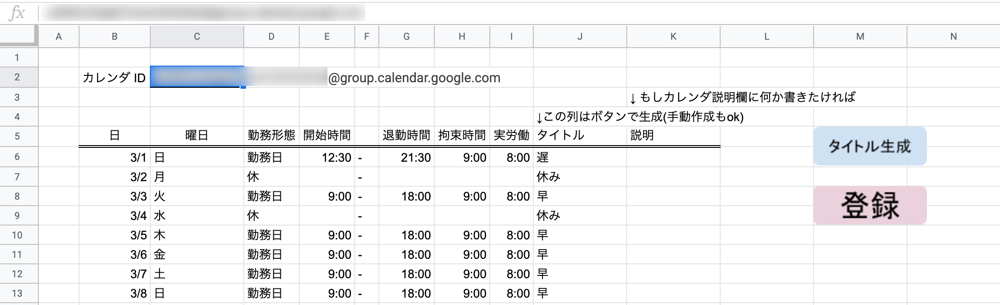

# spreadsheet2calednar

Sample script which regist schedules from google spread-sheet to google calendar written in GAS (Google Apps Script).  

The script saves our time in terms of filling out some schedules into google calendar.  
Fill out date, day, start time, end time, title and descriptions and so on, and then click the `register button` (written as `登録` in Japanese KANJI in the image).  
The schedules which written in the google spread sheet will be registered into your google calendar when the button clicked.

This document show how it works and some notifications to use this script.

The script are written as ES6 styled javascript.

## Getting Started

### Prerequisites

* google spread sheet
    * should create table and buttons if needed
* google calendar id
    * This script require a `calendar id`. You can find it in `Setting and sharing` in calendar option.
    * Copy it from calendar and then paste it into `C2` cell on the sheet.

I think that it's reccomended adding a new calendar to your own because:

* security reason (assuming share it to others)
    * should devide calendar as you like if you share it to others.
        * e.g.) private, jobs, hobbies, tasks and so on.
    * it has possibility which reveal your private shcedules to others if the calendar has multiple kind of schedules.
* in case of breaking data
    * this script deletes all calendar data before hand register shcedules because of avoiding duplicate registration.
    * this script do NOT know which schedule is important for you. it only do registraiton.

That's why it's better to have some calendars on the purpose.

### Installing

This script is available when you copy it into `Tools > Script editor`.

* fill out `calendar id` into `C2` cell
* generate title (click above button) (optional)
* regist schedules (click bottom button)

## Running the tests

You can test the scripts by these steps:

0. add a new calendar into your google calendar
0. copy the calendar id from google calendar and then paste it into `C2` cell on your google spread sheet
    * `calendar id` is like this: `90e2mvv8jquq6fh56smpd1k81s@group.calendar.google.com`
0. create a table which will be written your schedules
0. create buttons which will run specific function in the script
    * `main` function will regist your schedule from spread sheet to calendar
0. fill out shcedules into spread sheet
0. click the button which assigned a function
0. see your calendar whether the schedules has registered or not

In general, as well as VBA, scripts can pick data from specific cells.  
In others words, we have to fill out shcedules into the cell accurately.

Alert modal will apper in case something wrong with sheet or script.

## Authors

* Kengo Takimoto

## License

The MIT License (MIT)

Copyright (c) 2020 Kengo Takimoto

Permission is hereby granted, free of charge, to any person obtaining a copy of this software and associated documentation files (the "Software"), to deal in the Software without restriction, including without limitation the rights to use, copy, modify, merge, publish, distribute, sublicense, and/or sell copies of the Software, and to permit persons to whom the Software is furnished to do so, subject to the following conditions:

The above copyright notice and this permission notice shall be included in all copies or substantial portions of the Software.

THE SOFTWARE IS PROVIDED "AS IS", WITHOUT WARRANTY OF ANY KIND, EXPRESS OR IMPLIED, INCLUDING BUT NOT LIMITED TO THE WARRANTIES OF MERCHANTABILITY, FITNESS FOR A PARTICULAR PURPOSE AND NONINFRINGEMENT. IN NO EVENT SHALL THE AUTHORS OR COPYRIGHT HOLDERS BE LIABLE FOR ANY CLAIM, DAMAGES OR OTHER LIABILITY, WHETHER IN AN ACTION OF CONTRACT, TORT OR OTHERWISE, ARISING FROM, OUT OF OR IN CONNECTION WITH THE SOFTWARE OR THE USE OR OTHER DEALINGS IN THE SOFTWARE.
